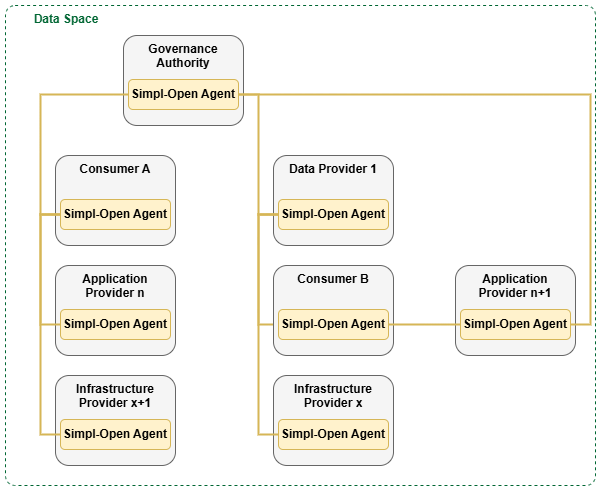
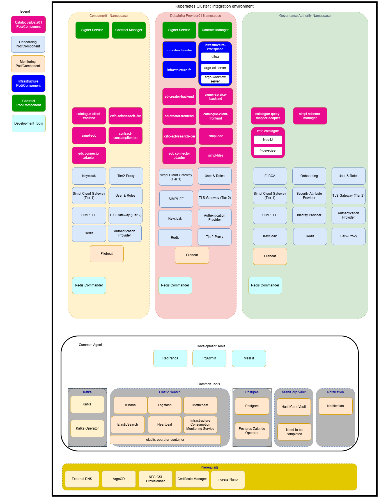
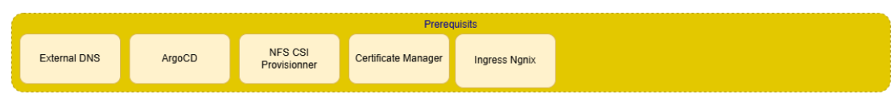
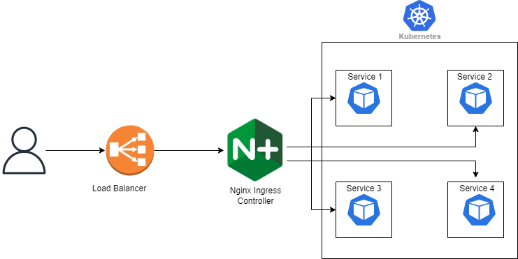

# Desplegament d'un agent de SIMPL-Open

* [Resum de Simpl-Open]()
* [Arquitectura i Requeriments]()
* [Desplegament dels Requeriments Mínims]()
* [Desplegament d'un Agent SIMPL-Open]()

# Resum de Simpl-Open

En el context del creixement exponencial de les dades i de l’estratègia europea per impulsar una economia basada en les dades, les Illes Balears representen un cas especialment rellevant a causa del pes estratègic del sector turístic. La gestió eficient, segura i sostenible de les dades turístiques és clau per millorar la competitivitat del sector, garantir la sostenibilitat del territori i oferir serveis públics i privats de més qualitat.

En aquest marc, s’està treballant en el desplegament de [Simpl-Open](https://simpl-programme.ec.europa.eu/) com a infraestructura base per a la creació d’un espai de dades turístic a les Illes Balears, alineat amb les polítiques de la Unió Europea. Simpl-Open, com a middleware de codi obert, modular i interoperable, permet federar dades, aplicacions i infraestructures provinents de diferents actors del sector turístic —administracions públiques, empreses, centres de recerca i proveïdors tecnològics— garantint la sobirania de les dades, la seguretat i la interoperabilitat.

L’ús de Simpl-Open facilita un model descentralitzat de compartició i processament de dades, permetent que la informació es tracti més a prop de la seva font (al edge), fet especialment rellevant en un territori insular amb una elevada pressió estacional. Aquest enfocament contribueix a millorar l’eficiència energètica, reduir costos i augmentar la resiliència dels serveis digitals.

La creació d’un espai de dades turístic basat en Simpl-Open permetrà integrar i reutilitzar dades procedents de diferents fonts, com ara fluxos de visitants, mobilitat, ocupació hotelera, recursos naturals, serveis públics i impacte ambiental. Això possibilitarà una presa de decisions més informada, tant per part del sector públic com del privat, afavorint polítiques turístiques més sostenibles, una millor planificació territorial i una experiència turística de major qualitat.

A més, aquest desplegament posiciona les Illes Balears com un territori pilot i referent dins la Federació Europea del Núvol i els espais de dades sectorials, contribuint a l’objectiu europeu de crear una societat impulsada per les dades, alhora que es preserven els interessos locals, la transparència i la governança compartida.

# Arquitectura

Al nucli dels espais de dades hi ha els cinc tipus d’actors que Simpl-Open considera. Aquests actors són una representació simbòlica d’una xarxa distribuïda de parts cooperants dins d’un ecosistema obert. Simpl-Open, representat pel Agent Simpl-Open, s’estén a través d’aquests actors i permet la compartició d’actius entre ells. Proporciona serveis comuns sobre els quals es poden construir els espais de dades.

Simpl-Open es manté agnòstic respecte a les particularitats d’un espai de dades concret, fet que permet afegir serveis específics de cada espai de dades per damunt de Simpl-Open. Aquesta capa addicional pot, per exemple, contenir estàndards de representació de dades, fer complir certificacions comunes de qualitat o definir normes de revisió entre iguals (peer review) per avaluar la qualitat de les dades. Els serveis específics de l’espai de dades adapten l’ecosistema més enllà de la simple compartició d’actius, assegurant que aquests actius esdevinguin valuosos per als participants.

Simpl-Open no només té com a objectiu ser utilitzat per construir espais de dades, sinó que també crea interoperabilitat entre diferents espais de dades. A mesura que múltiples espais de dades incorporen Simpl-Open, aquests esdevenen més connectats. Això permet que els serveis travessin els límits dels espais de dades específics. Inicialment, aquests serveis seran més limitats, ja que Simpl-Open no pot capturar els detalls de tots els espais de dades diferents. Correspondrà a l’usuari gestionar les especificitats de cada espai de dades a l’hora d’interpretar els actius que obté.

Per fer aquesta visió il·lustrativa més tangible, la figura següent presenta un exemple de com un conjunt d’actors distribuïts es podria interconnectar per formar un espai de dades. És important remarcar que aquesta figura mostra només un possible escenari entre moltes formes diferents d’interacció entre participants. El nombre de participants en un espai de dades, o el nombre de parts interessades darrere d’un sol actor, només està limitat per la viabilitat tècnica. Això implica que un gran nombre de participants i parts interessades poden interactuar simultàniament. L’Agent Simpl-Open que apareix a la figura serveix com a component abstracte que els actors han de desplegar per formar part de l’espai de dades.



Com podem veure, els 5 agents considerats són:

- Agent de governança
- Agent consumidor
- Agent proveïdor
- Agent proveïdor d'infraestructura (pendent de desenvolupament)
- Agent proveïdor d'aplicacions (pendent de desenvolupament)

Aquests agents tenen les següents funcions:

- Agent de governança: és el responsable de definir, crear, desenvolupar, operar i mantenir el framework de governança de l’espai de dades. Aquest agent vetlla pel compliment de les normes, polítiques i mecanismes comuns que regulen la compartició, l’accés, la seguretat i l’ús de les dades, garantint la confiança entre tots els participants. A més, s’encarrega de registrar els participants dins de l’espai de dades i de gestionar tant els certificats acreditatius com les credencials associades.

- Proveïdor de dades: són els actors que ofereixen un o més conjunts de dades dins l’espai de dades. Aquests agents mantenen el control sobre les seves dades i en regulen l’ús mitjançant polítiques d’accés, condicions d’ús i requisits específics, assegurant que les dades es comparteixin de manera segura.

- Consumidor de dades: són els actors que cerquen, accedeixen i utilitzen les dades posades a disposició pels proveïdors de dades. L’ús de les dades es realitza sempre d’acord amb les polítiques i condicions establertes pels proveïdors i amb el marc de governança definit per l’espai de dades.

Els participants que es vulguin adherir a l'espai de dades podran desplegar tant l'agent proveïdor com consumidor, segons el paper que vulguin tenir dins aquest espai.

Els agents de SIMPL-Open es despleguen en un clúster de Kubernetes, i cada servei s’executa dins d’un Pod com a contenidor Docker.
A la imatge següent es mostra un exemple en què tots els agents es troben desplegats dins un mateix clúster:



Tanmateix, a la pràctica, cada participant només desplegarà aquells agents que corresponguin a les funcionalitats que necessiti. Independentment dels agents seleccionats, tots els desplegaments requereixen la presència del Common Agent dins el mateix clúster. Aquest component inclou un conjunt d’aplicacions i serveis comuns que són necessaris per al funcionament de tots els agents.

A més, cada agent requereix el compliment d’uns prerequisits específics, que també han d’estar disponibles dins del clúster on es desplegui. Tenint en compte el funcionament dels agents, recomanem les següents combinacions de desplegament segons les funcionalitats que el participant vulgui tenir:

1. Prerequisits + Common Agent + Provider Agent

    - Recomanat si només es volen les funcionalitats de publicació de descripcions al catàleg federat.

2. Prerequisits + Common Agent + Consumer Agent

    - Recomanat si només es volen les funcionalitats de consulta al catàleg federat.

3. Prerequisits + Common Agent + Consumer Agent + Provider Agent

    - Recomanat si es volen utilitzar les funcionalitats tant de consulta com de publicació.

L'agent de governança només el desplegarà l'entitat que gestioni tot l'espai de dades. 

En un entorn de producció cadascuna d'aquestes combinacions d'agents requereixen d'una mínima infraestructura. El nostre entorn es va fer damunt un clúster d'azure kubernetes en el qual varem utilitzar aquests requeriments de guia:

1. Common Components Agent
    - 1 Node "Working"
    - Memòria persistent, ReadWriteOnce: 300GB
2. Consumer Agent
    - 2 Nodes "Working"
    - Memòria persistent, ReadWriteOnce: 20GB
    - Memòria persistent, ReadWriteMany: 2GB
3. Provider Agent
    - 2 Nodes "Working"
    - Memòria persistent, ReadWriteOnce: 35GB
    - Memòria persistent, ReadWriteMany: 2GB

Si despleguéssim tant l’agent proveïdor com el consumidor, la configuració estimada seria:
1 node per al Common Components Agent + 2 nodes per al Consumer Agent + 2 nodes per al Provider Agent, és a dir, un total de 5 nodes. Tot i que aquí separem els nodes requerits per agent, això no significa que els serveis de cada agent ocupin nodes separats; la suma d’aquests nodes es desplegarà dins del mateix node pool.

Els nodes utilitzats eren de tipus Standard_D4s_v3 (4 vCPU i 16 GB de RAM). Aquests nombres són estimacions que han estat suficients en el nostre entorn, però si els recursos del clúster quedessin saturats, es podrien augmentar de dues maneres:

1. Incrementant el nombre de nodes.
2. Incrementant els recursos de cada node: per exemple, canviant els nodes de Standard_D4s_v3 a Standard_D8s_v3 (8 vCPU i 32 GB RAM).

Tot i que aquesta documentació explica la nostra experiència amb el desplegament d’un agent SIMPL-Open a Azure, el mateix desplegament és possible en altres entorns, sempre que es compleixin els requisits mínims del clúster.

### Requisits addicionals per al participant

1. Domini DNS propi: La comunicació entre agents es farà a través d’una gateway amb IP pública i DNS associat.
2. Possibilitat d’assignar IPs públiques: Alguns serveis dins del clúster ho requereixen.

### Ordre de desplegament

1. Requeriments Mínims
2. Common Components Agent
3. Consumer/Provider Agent

Aquest apartat es basa en la documentació oficial de [Simpl-Open](https://code.europa.eu/simpl/simpl-open/documentation).

# Desplegament dels Requeriments Mínims

Són els serveis que donen suport a la resta dels serveis associats als agents.



Aquests tenen les següents funcionalitats:

1. Ingress NGINX: actua com a controlador d’ingrés del clúster, gestionant l’accés extern als serveis desplegats a Kubernetes mitjançant regles HTTP/HTTPS. Permet exposar els serveis de manera segura i centralitzada, i facilita la gestió del trànsit d’entrada.

2. Argo CD: eina de desplegament continu basada en el paradigma GitOps. S’encarrega de sincronitzar l’estat del clúster amb la configuració declarativa definida en repositoris Git, garantint desplegaments traçables, reproductibles i auditables. En el nostre cas, ArgoCD sincronitzarà els repositoris de [SIMPL-Open Europe](https://code.europa.eu/simpl), els quals contenen les versions de les aplicacions i serveis associats a cada agent, amb l'estat del clúster.

3. External DNS: automatitza la creació i gestió dels registres DNS associats als serveis exposats del clúster. Permet actualitzar dinàmicament els registres DNS en funció dels serveis i ingressos desplegats.

4. NFS CSI Provisioner: proveeix un Container Storage Interface (CSI) basat en NFS que permet la creació dinàmica de volums persistents, especialment útil per a volums amb accés compartit (ReadWriteMany).

5. Certificate Manager: gestiona de manera automàtica l’emissió, renovació i ús de certificats digitals (per exemple, TLS/SSL) dins del clúster, facilitant la comunicació segura entre serveis i amb l’exterior.

### Desplegament i Configuració de Ingress Nginx

Controlador d'ingrés basat en Nginx, gestiona el tràfic d’entrada HTTP/HTTPS cap a les aplicacions del clúster. Treballa conjuntament amb External DNS i Certificate Manager per exposar serveis de manera segura i automatitzada.



### Instal·lació

```bash
helm repo add ingress-nginx https://kubernetes.github.io/ingress-nginx
helm repo update

kubectl create namespace ingress-nginx
helm install ingress-nginx ingress-nginx/ingress-nginx \
    --namespace ingress-nginx \
    --set controller.replicaCount=2 \
    --set controller.nodeSelector."kubernetes\.io/os"=linux \
    --set defaultBackend.nodeSelector."kubernetes\.io/os"=linux


helm install ingress-nginx ingress-nginx/ingress-nginx \
  --namespace ingress-nginx --create-namespace \
  --version 4.10.0
```

L'eina tindrà el seu propi namespace. Comprovam que s'ha instal·lat correctament:

```bash
kubectl get pods -n ingress-nginx
```

Hauria de sortir:

```bash
NAME                                       READY   STATUS      RESTARTS   AGE
ingress-nginx-admission-create-qhjcq       0/1     Completed   0          4d20h
ingress-nginx-admission-patch-s2695        0/1     Completed   0          4d20h
ingress-nginx-controller-9cc49f96f-96xdq   1/1     Running     0          4d20h
```

A continuació comprovarem l'IP extern o port del controlador ingress

```bash
kubectl get svc -n ingress-nginx
```

Hauria de sortir:

```bash
NAME                                 TYPE        CLUSTER-IP     EXTERNAL-IP   PORT(S)                      AGE
ingress-nginx-controller             NodePort    10.111.45.147   <none>        80:32691/TCP,443:32613/TCP   4d20h
ingress-nginx-controller-admission   ClusterIP   10.101.37.174   <none>        443/TCP                      4d20h
```

Podem veure que per defecte tipus de servei del controlador d'ingress és "NodePort". En el nostre cas vàrem canviar el tipus a "LoadBalancer".

Un Load Balancer (equilibrador de càrrega) és un component que:

1. Rep el trànsit entrant des d’Internet

2. El distribueix entre diversos pods o nodes

3. Proporciona un únic punt d’entrada a les aplicacions

4. Millora la disponibilitat, escalabilitat i tolerància a fallades

5. En Kubernetes, el Load Balancer és habitualment el punt d’accés públic cap al clúster.

En el cas d'Azure, aquest LoadBalancer rep una ip pública automàticament. Si a l'entorn on es desplega aquest LoadBalancer no hi ha aquesta assignació automàtica 
de la IP pública, s'haurà de fer manualment.

### Desplegament i Configuració de ArgoCD
### Desplegament i Configuració de External Manager
### Desplegament i Configuració de Certificate Manager
### Desplegament i Configuració de NFS CSI provisioner

# Desplegament d'un Agent

### Desplegament del Common Components Agent
### Desplegament del Provider Agent
### Desplegament del Consumer Agent

# Referències

- Comissió Europea. *Simpl-Open – Open Source Middleware for European Data Spaces*. Documentació oficial del projecte.